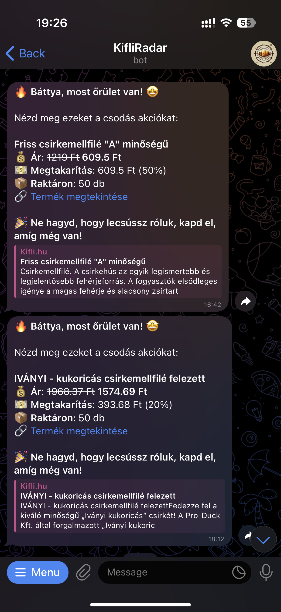
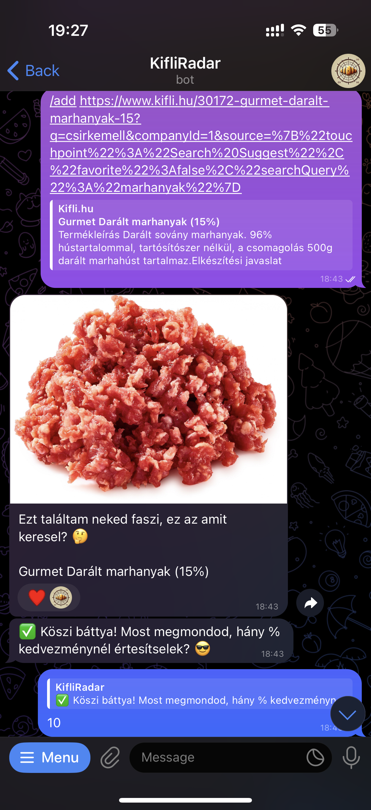
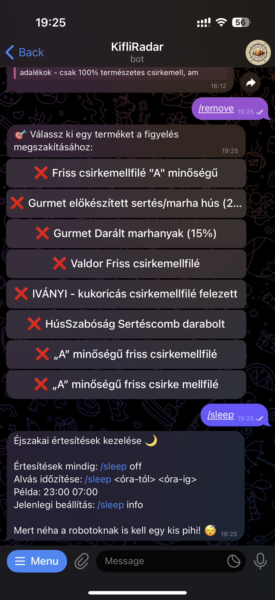

# 🛒 Kifli Last-Minute Product Watcher

<p align="center">
    
</p>

Receive alerts about [Kifli.hu](https://kifli.hu)'s best last-minute offers! This serverless application respects your sleep schedule by keeping an eye on specific products and notifying you via Telegram when they meet your discount requirements.

## ✨ Screenshots

<p align="center">
    
    
    
</p>

## 🚀 Features

-   **Targeted Product Monitoring**: Watch specific products on Kifli.hu's last-minute section.
-   **Customizable Discount Alerts**: Set a minimum discount percentage to trigger notifications.
-   **Telegram Notifications**: Receive instant alerts via a Telegram bot.
-   **Sleep Schedule**: Define "do not disturb" periods (timezone-aware) to avoid unwanted notifications.
-   **Notification Cooldown**: Prevents spamming by setting a minimum time between notifications for the same product (configurable).
-   **Product Analytics**: Logs historical data for products meeting a certain discount threshold (configurable).
-   **Serverless Architecture**: Built with AWS Lambda for scalability and cost-efficiency.

## 🛠️ Tech Stack

-   **Backend**:
    -   [AWS Lambda](https://aws.amazon.com/lambda/): Serverless compute function running the core logic.
    -   [AWS DynamoDB](https://aws.amazon.com/dynamodb/): NoSQL database for storing user preferences, watched products, and analytics.
    -   [TypeScript](https://www.typescriptlang.org/): Strongly typed language for robust development.
-   **Notifications**:
    -   [Telegram API](https://core.telegram.org/bots/api): Used for sending notifications via the [grammy](https://grammy.dev/) library.
-   **Deployment & Infrastructure**:
    -   [SST (Serverless Stack)](https://sst.dev/): Framework for building and deploying serverless applications on AWS.
-   **Testing**:
    -   [Jest](https://jestjs.io/): JavaScript testing framework.
    -   [AWS SDK Client Mock](https://github.com/m-radzikowski/aws-sdk-client-mock): For mocking AWS SDK v3 clients in tests.

## 📦 Getting Started

1.  **Clone the repository:**
    ```bash
    git clone https://github.com/kadaradam/kifli-radar.git
    cd kifli-radar
    ```

2.  **Install dependencies:**
    *(Ensure you have Node.js(v22.13.0+) and pnpm(v8.15.4+) installed)*
    ```bash
    pnpm install
    ```

3.  **Configure Environment Variables:**
    You'll need to set up environment variables, including:
    -   AWS Credentials (configured for your environment)
    -   `TELEGRAM_BOT_TOKEN`: Your Telegram Bot Token.
    -   `APP_PASSWORDS`: Your app passwords for the Telegram bot.

    Copy the `.env.example` file and configure your environment:
    ```bash
    cp .env.example .env
    ```

4.  **Run the application locally:**
    ```bash
    pnpm sst dev
    ```

5.  **Setup Telegram Bot Webhook:**
    Once the application is running locally, navigate to the `WebhookSetup` tab in your SST terminal output to automatically set up the Telegram bot webhook.

    or

    Set it manually by running the following command:
     ```bash
    pnpm setup-bot --url <your-lambda-webhook-url>
    ```

6.  **(Optional) Run tests:**
    ```bash
    pnpm test
    ```

---

7.  **Deploy to production using SST:**
    ```bash
    pnpm sst deploy --stage <your-stage-name> # e.g., any preview stage name or production
    ```

Enjoy tracking those Kifli deals! 🥐 